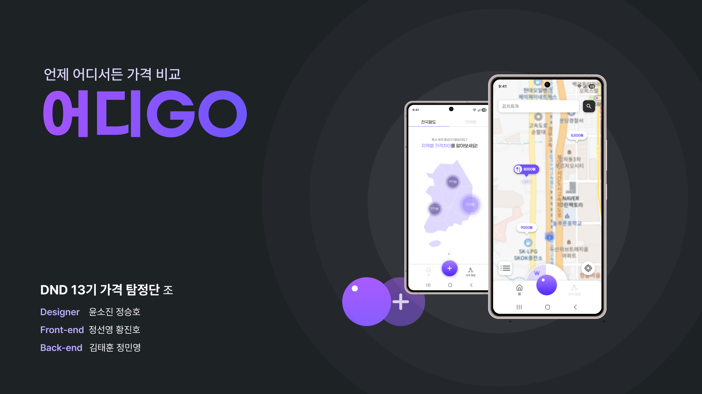
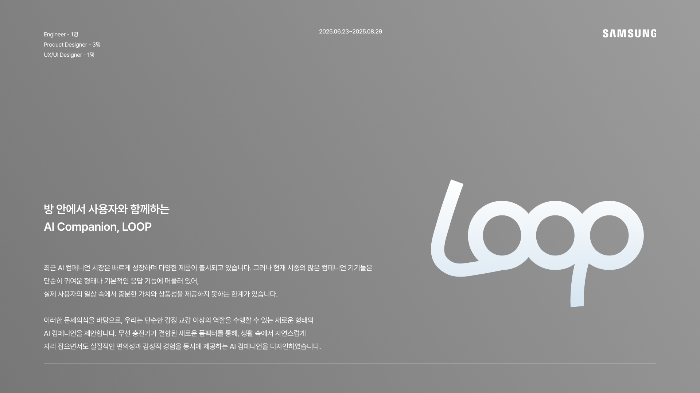
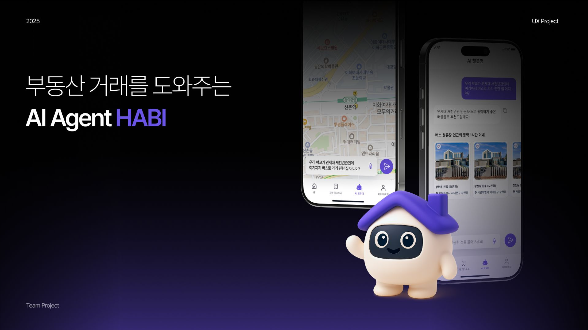

# Jung Seungho 포트폴리오

UX 디자이너  
서울시 광진구 거주, 
세상의 크고 작은 문제를 발견하고 사용자의 시선에서 해결합니다. 
사용자의 목소리에 의존하지 않고 창의적 솔루션을 제시하는 디자이너 입니다.

---

## 소개

데이터를 단순히 분석하는 데 그치지 않고, **사용자가 직관적으로 이해하고 공감할 수 있는 경험으로 전환하는 것**을 목표로 합니다.  
리서치부터 프로토타이핑까지 전 과정을 수행하며, **데이터 기반의 논리와 사람 중심의 디자인 감각을 연결**하는 UX를 추구합니다.

**핵심 역량**
- 사용자 경험 리서치 및 데이터 기반 인사이트 도출  
- 인터랙션 디자인 및 프로토타이핑 (Figma, After Effects 등)  
- 데이터 시각화 및 커뮤니케이션 (Tableau, Altair, Python 등)  
- 모바일 앱 UX/UI 설계 및 개발 협업 (AOS, iOS 기반 프로젝트 경험)

---

## 프로젝트

### 1. DND 프로젝트 – 가격 비교 서비스 **“어디GO”**

**기간:** 2025.07 – 2025.08  
**역할:** UX/UI 기획 및 프로토타이핑  
**기술 스택:** Figma  
**요약:** 공공데이터와 사용자 입력 데이터를 활용해 일상 물가를 직관적으로 비교·체감할 수 있는 모바일 앱 개발 프로젝트.  
사용자 리서치부터 프로토타입 제작, 앱 작동 단계까지 전 과정에 참여.

---

### 2. 삼성전자 산학 협력 프로젝트 – **AI Companion UX**

**기간:** 2025.06 – 2025.08  
**역할:** UX 기획 및 감성 인터랙션 설계  
**기술 스택:** Figma, After Effects  
**요약:** 1인 가구의 정서적 웰빙을 위한 AI 컴패니언의 UX 설계 프로젝트.  
로봇 및 디스플레이 워킹 프로토타입 제작을 통해 감정 기반 인터랙션 모델을 제안.

---

### 3. 부동산 거래 AI Agent 서비스 **“HABI”**

**기간:** 2025.03 – 2025.06  
**역할:** UX 리서치 및 서비스 플로우 설계  
**기술 스택:** Figma  
**요약:** 세입자 중심의 부동산 거래 경험을 개선하기 위한 AI Agent 서비스 기획.  
사용자 여정 분석을 기반으로 거래 과정의 신뢰와 투명성을 높이는 앱 프로토타입 설계.

---

## 기술 스택

| 분야 | 도구 |
|------|------|
| UX 리서치 | 인터뷰, 설문, 어피니티 다이어그램, 저니맵, FGI |
| 프로토타이핑 / 디자인 | Figma |
| 인터랙션 / 모션 | After Effects |
| 데이터 분석 / 시각화 | Python (Polars, Matplotlib, Altair), Tableau |
| 협업 / 관리 | Notion, Slack, GitHub |

---

## 학력 및 이력

- **국민대학교 예술대학**, 입체미술전공 (2017–2024)
- **연세대학교 커뮤티케이션 대학원 커뮤니케이션 디자인** 석사 과정 (2025–)

---

## 연락처

| 구분 | 내용 |
|------|------|
| 이메일 | wjdtmdgh20@yonsei.ac.kr |
| GitHub | [github.com/myname](https://github.com/Seungho20) |
| 포트폴리오 사이트 | [myname.github.io](https://seungho20.github.io/homepage/) |

---

## Tableau 시각화 프로젝트
데이터 기반 UX 리서치 시각화 결과를 인터랙티브하게 확인할 수 있습니다.

<iframe 
  src="tableau.html" 
  width="100%" 
  height="700" 
  frameborder="0" 
  style="border-radius: 12px; border: 1px solid #ddd;">
</iframe>

